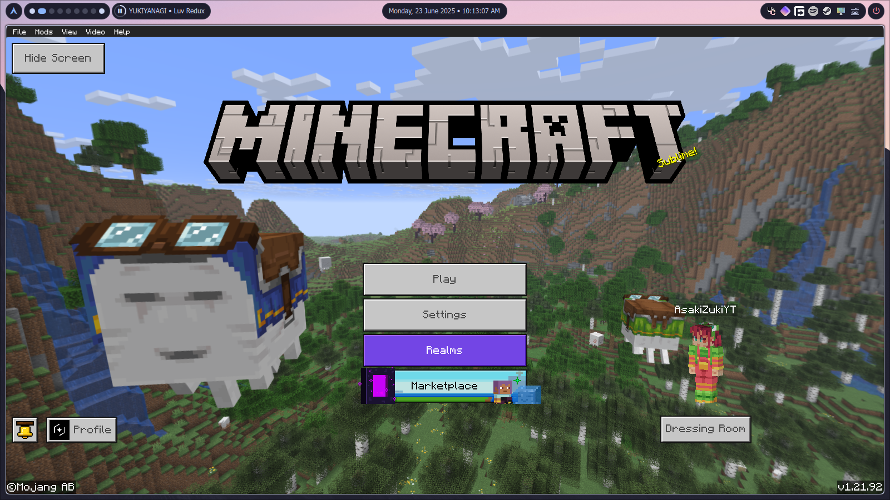

# kapUI Scripting

A framework specifically designed for creating UI resource packs using JavaScript/TypeScript for Minecraft: Bedrock Edition, packed with many useful utilities!

# Installation

<p>To install it into your project, you need to have <b>Node.js</b> pre-installed to use it!</p>

<p>You also need to create a project and use the following command to start using <b>kapUI Scripting</b>:</p>

```batch
npm install kapUI-scripting
```

<p>That command will add the kapUI Scripting library to your project, and you can start using it.</p>

# How to use

<p>The syntax is very simple. If you just want to add a button to hide start screen, here is the code for that:</p>

```javascript
import { Anchor, BindingName, UI, Vanilla } from "kapUI-scripting";

// Game start screen content
const vanillaStartScreenContent = Vanilla.start.startScreenContent();

// A custom start screen
const ourStartScreenContent = UI.panel({ size: "100%" }).addChild(vanillaStartScreenContent);

// Toggle for hide start screen
const ourToggle = UI.extend(Vanilla.commonToggles.lightTextToggle(), {
    w: 84,
    h: 28,
    $button_text: "Hide Screen",
    $toggle_name: "hide_start_screen",
    $toggle_view_binding_name: "hide_start_screen_state",
});

// Add toggle to start screen content
ourStartScreenContent.addChild(ourToggle, {
    anchor: Anchor.TopLeft,
    x: 5,
    y: 5,
});

vanillaStartScreenContent.override.addBindings([
    {
        binding_name: BindingName.ScreenNeedsRebuild,
        binding_name_override: "#bind_0",
    },
    {
        source_control_name: "hide_start_screen_state",
        source_property_name: "#toggle_state",
        target_property_name: "#bind_1",
    },
    {
        source_property_name: "[!#bind_0 && !#bind_1]",
        target_property_name: "#visible",
    },
]);

// Modify start screen content
Vanilla.start.startScreen({
    $screen_content: ourStartScreenContent.getPath(),
});
```

<p>And you just need to run the code you wrote, and here is the result:</p>

<p align="center">
    
</p>
